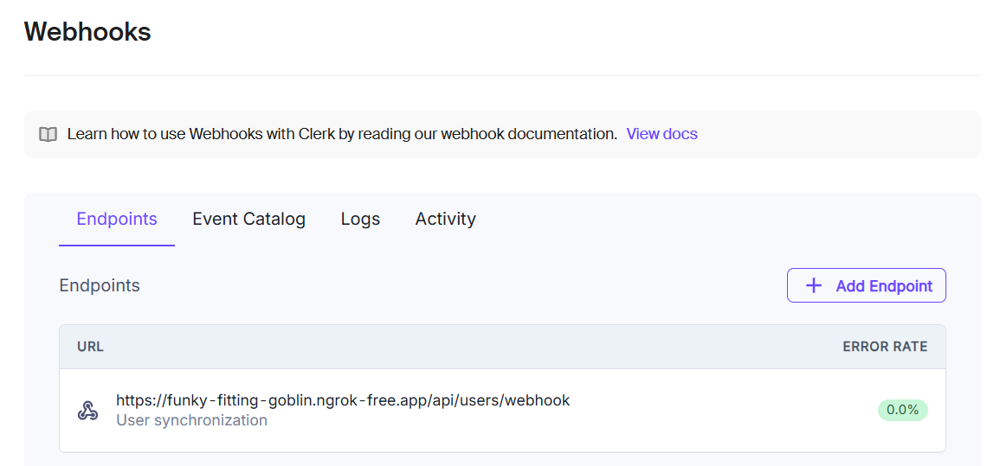

# Webhook Sync

数据库与 clerk 数据同步

## 内网穿透: ngrok

### 下载 ngrok.exe

```sh
@lblin ➜ clone  .\ngrok config add-authtoken 2tobvbbPlY06BWJuNB8c3OfoRDQ_4XSw8LdwrRpqAGVer1ihx
Authtoken saved to configuration file: C:\Users\lblin\AppData\Local/ngrok/ngrok.yml

# @lblin ➜ new-tube git(master)  ../ngrok --version
# ngrok version 3.20.0
```

### 使用 ngrok

```sh
../ngrok http --url=funky-fitting-goblin.ngrok-free.app 3000
# https://funky-fitting-goblin.ngrok-free.app/
```

### concurrently 启动

```sh
pnpm run dev:all
```

## Clerk Webhook

### 配置



### svix

```sh
pnpm add svix@1.45.1
```

### route

### 验证

clerk delete user

## 静态域名
