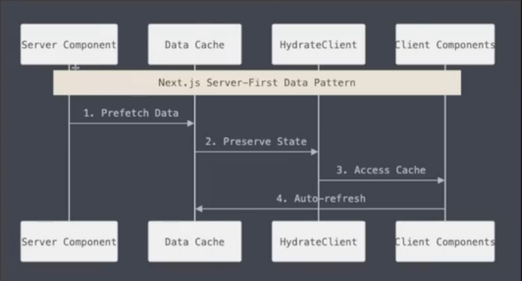
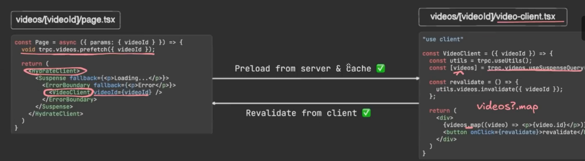

# tRPC setup

## tRPC

1. 端到端类型安全
2. 类似 react 的 hook 函数（useQuery, useMutation etc）
3. v11 tRPC 允许认证预取 (authenticated prefetching)

## prefetch

1. "render as you fetch"
2. 利用 React 服务端组件 RSCs 作为加载器 loaders




## tRPC 配置

https://trpc.io/docs/client/react/server-components

### install

```sh
pnpm add @trpc/server@11.0.0-rc.730 @trpc/client@11.0.0-rc.730 @trpc/react-query@11.0.0-rc.730 @tanstack/react-query@5.65.1 zod client-only server-only
```

### tRPC router

### Query Client factory

### Create a tRPC client for Client Components

注意要用 TRPCProvider 包裹 body 内所有部分

### Create a tRPC caller for Server Components

### 编辑器设置以保证代码提示

### 使用

```sh
pnpm add react-error-boundary@5.0.0
```

PageClient
